# Advanced Material Systems - Harry Dillamore

## Stylized Water Material with World Position Offset

| **Requirement** | **Description / Implementation** | **Evidence** |
| --- | --- | --- |
| **World Position Offset**     | The world position offset is used to deform the vertices of an object , this can be used for the water to create waves on the surface. In the material graph, I implemented the WPO effect by using panning textures which use the `texCoord` and an adjustable `scale` parameter as input to the textures' UVs to move across the the material. I have used two textures so there is some distortion on a macro scale using a noise texture and a waves on a larger scale using a wave texture. I have allowed adjustment using the parameters for scale, speed, and size for each the large waves and the small waves. These parameters adjust: the scale of the texture used for WPO, the speed at which the texture is panned, and the size - in height - of the waves. WPO is much cheaper than using a skeletal mesh, but the cost on performance increases with the vertex density of the mesh. I have used a mesh with many vertices for the smoothest effect, but less complex geometry would be appropriate for a larger scale application but would lead to sharper and more 'blocky' waves. |    *Figure 1 - Wireframe view of water*   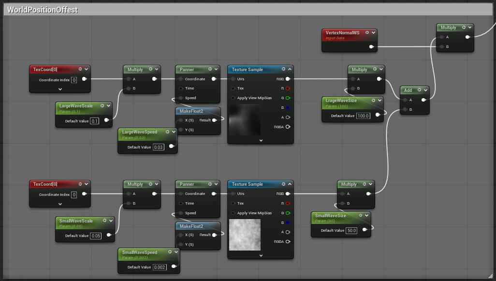   *Figure 2 - Material graph (WPO water)* |
| **Visual Elements - Foam**    | Foam is generated dynamically based on proximity to objects in the water. The implementation relies on the `DistanceToNearestSurface` node, which calculates how far any pixel on the water's surface is from any other geometry. This distance is used to create a "distance field," allowing the `FoamDist` parameter to control how far the foam extends from an edge. To create the foam's rippling appearance, a wave is generated using `Time` and a `Sine` node. The effect is adjusted by the `FoamSpeed` and `FoamLines` parameters which allow more customisation of the speed and size of the foam waves. Finally, panning noise textures are used - one micro and one macro - which break up the lines for a more natural appearance. |  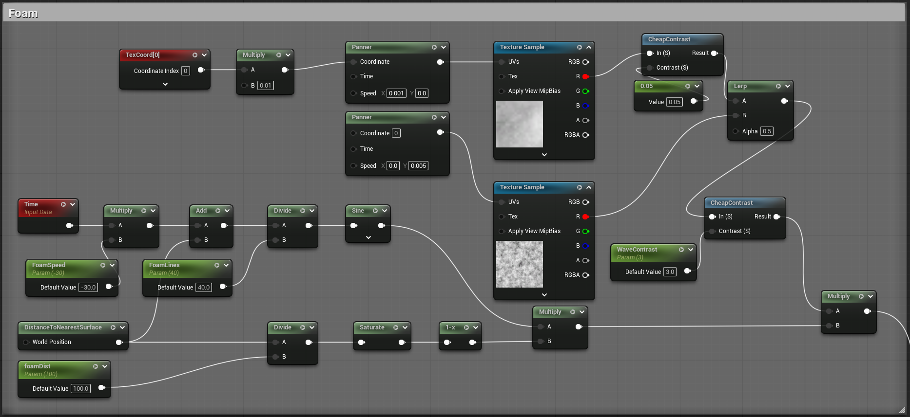 |
| **Visual Elements - Normals** | The normal maps define how light interacts with the surface of the water and allows light to reflect in varied directions as would be seen in real life. To add fine, high - frequency detail to the water surface, I have used two separate normal maps which simulate small waves and distortion on the surface of the water. I use the `blendAngleCorrectedNormals` node to combine the two normal map textures. The direction that the normal maps pan in is controlled by `windDirection` and the speed of the panning is controlled by `wind`. These are MPC parameters which can be changed by the user or in blueprints during runtime. The direction is normalised and multiplied by the wind amount, then used for the panning of each normal map |       |

   *Figure X - Final water material*

## Material Parameter Collection

| **Requirement**| **Description / Implementation** | **Evidence**|
| --- | --- | --- |
| **MPC Parameters** | I created an MPC with a variety of parameters that would let me control weather effects in the level, the MPC gives a central location to manage theses effects and  means I can use singular parameters to affect as many materials as needed. If I was working in a team, I could also see how this makes it very easy for other people such as artists to tweak the look of the world. | 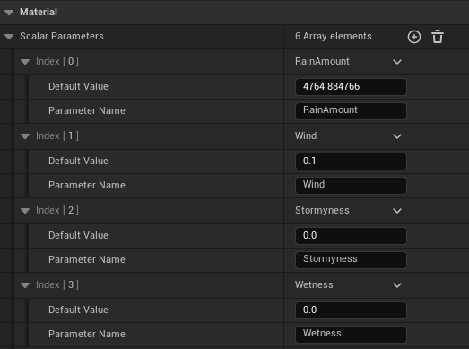   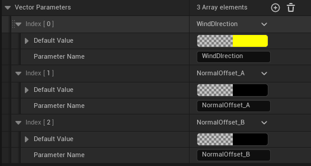|
| **Modification during runtime** | I created a weather cycle blueprint that changes the weather effects smoothly based on a custom float curve and `CycleDurationSeconds` I also wanted the water to be smoothly adjusted based on `wind` and `windDirection` but I found that the `panner` node caused jumping during the transition, from what I found this is because it calculates the pan amount using $panSpeed \times gameTime$. Because the game time is always a high number any changes to the pan speed result in a big visual jump. To fix this I instead calculate what the difference in each frame of the pan should be, meaning that there are no jumps when the speed is changed. |    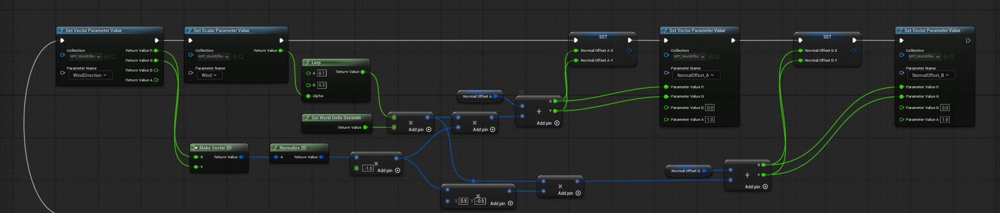   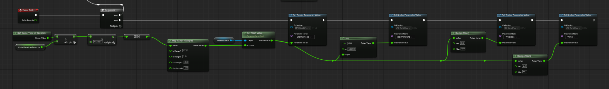 |
| **Material Implementation and Consistency** | The MPC's parameters are used across multiple materials to create a cohesive environmental effect. For example the `wetness` parameter is used with a material function to decrease the ground's roughness and it's brightness. This process could be easily replicated in any materials that are exposed to the weather. It is also used to `LERP` the ground normals in order to add puddles when the ground is wet. At the same time, the `stormyness` parameter is used to change the colour of the water and increase the `storm clouds` parameter of the volumetric cloud material. In addition the `RainAmount`, `WindDirection` and `Wind` are used to drive the relative parts of the rain particle system as well as the direction and speed of waves on the water surface and the speed of puddles on the ground.   This guarantees visual consistency because all environmental elements are driven by the same source. MPCs are also more performant than updating many individual material instances, because the the engine is able to batch all MPC changes into one efficient update for the GPU. | 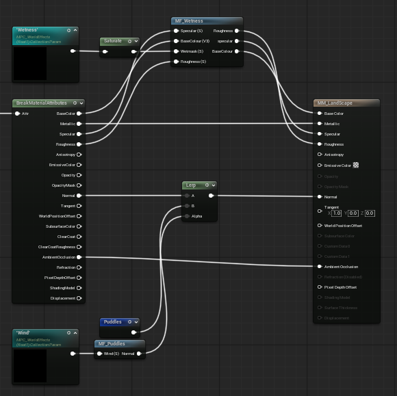   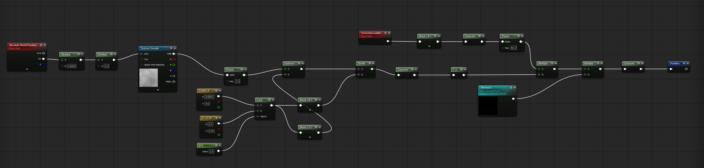   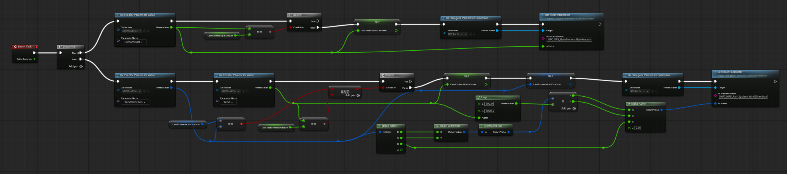   [BP for updating cloud material fog density using MPC](image-16.png) |

## Parallax Occlusion Mapping (POM) Material

| **Requirement**| **Description / Implementation** | **Evidence**|
| --- | --- | --- |
| **POM Implementation** | POM is used to fake 3D detail on a flat surface. It is able to create a much more convincing 3D effect compared to normal maps and similar. It does this by using raymarching across the texture to find the visible depth of each pixel, this allows self shadowing and parallax effects to function. For example, parts of the texture that are high up occlude the lower points behind them. In the material graph I use the `ParallaxOcclusionMapping` inputting the heightmap of the texture I am using and the `TexCoord` node - the parallax UV output is then used to go into the UV input of each texture used. I have made parameters for most of the other inputs to the `ParallaxOcclusionMapping` to allow customisation of the level of detail of the effect.  | 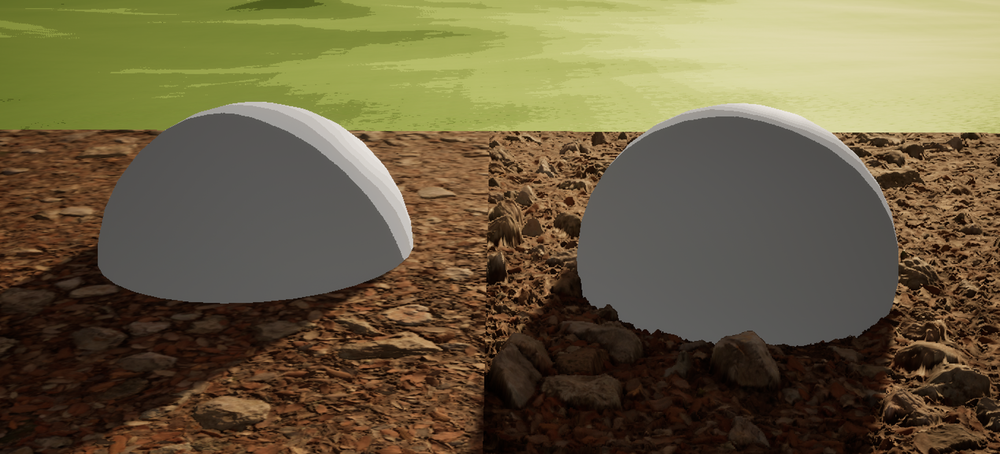   [POM material Graph](image-18.png) |
| Quality Performance and Limitations | The level of detail is mainly controlled by the `MinSteps` and `MaxSteps`

<https://fab.com/s/de31b726d9df>

## Cel Shading Effect

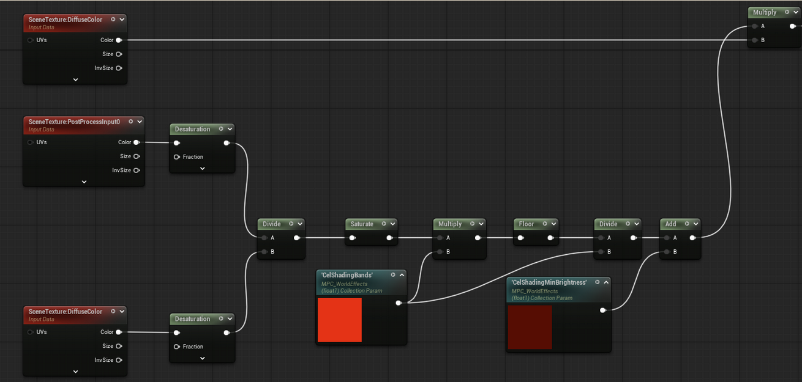

*Figure X - Cel Shading material graph*

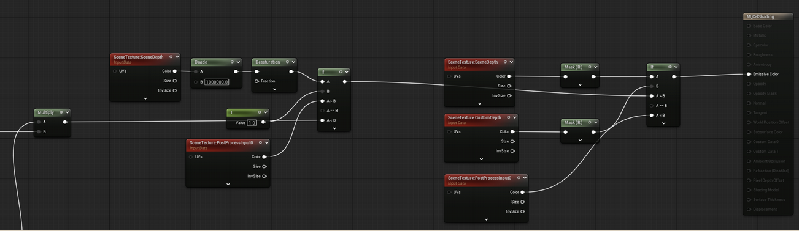

*Figure X - Cel Shading material graph*

This cel shading setup is good because it allows me to apply the cel shaded effect to any object I want to by simply toggling the render CustomDepthPass option, avoiding making multiple

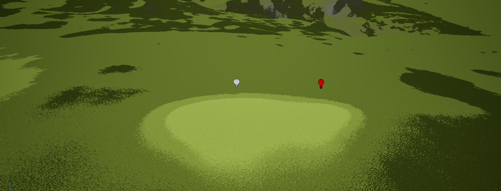

*Figure X - White light compared to red light using cel shading*

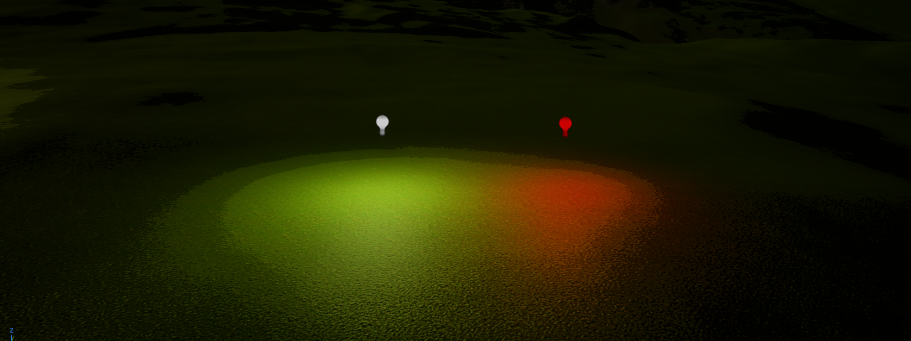

*Figure X - White light compared to red light using new cel shading logic*

---
