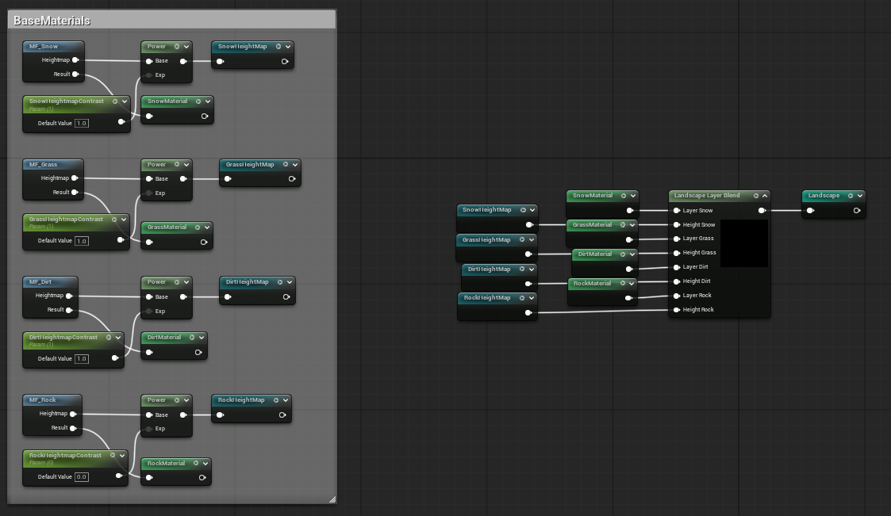
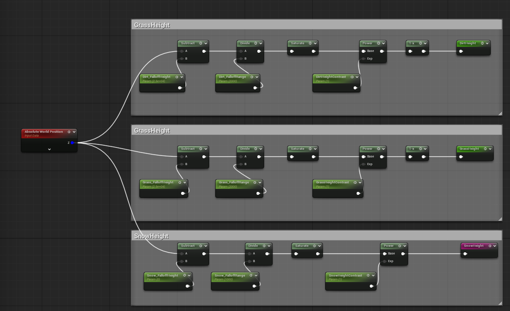
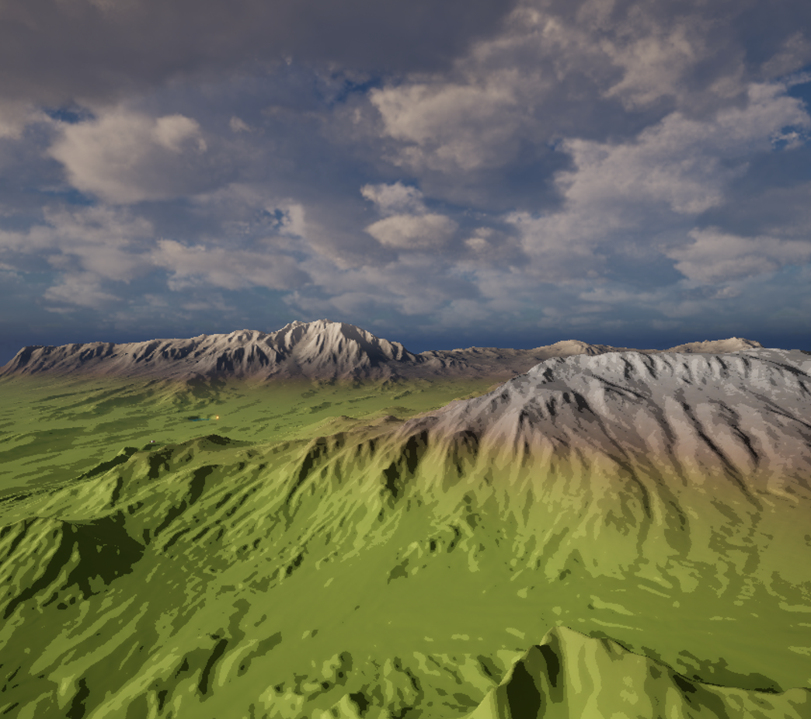
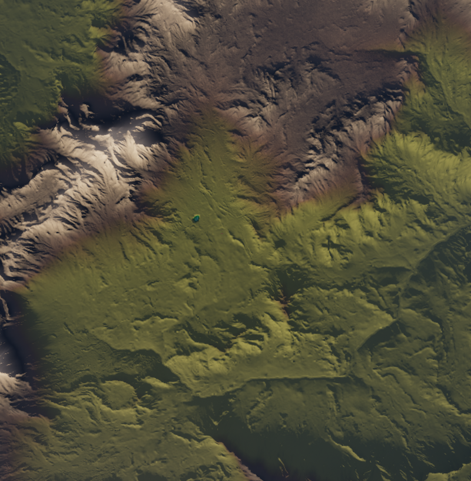
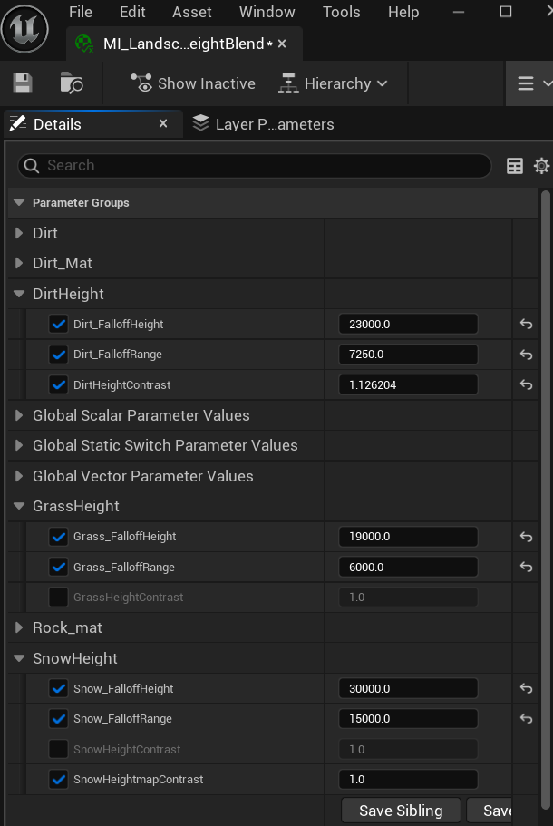
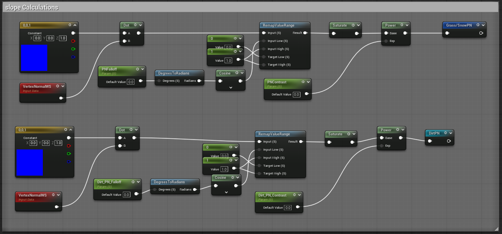
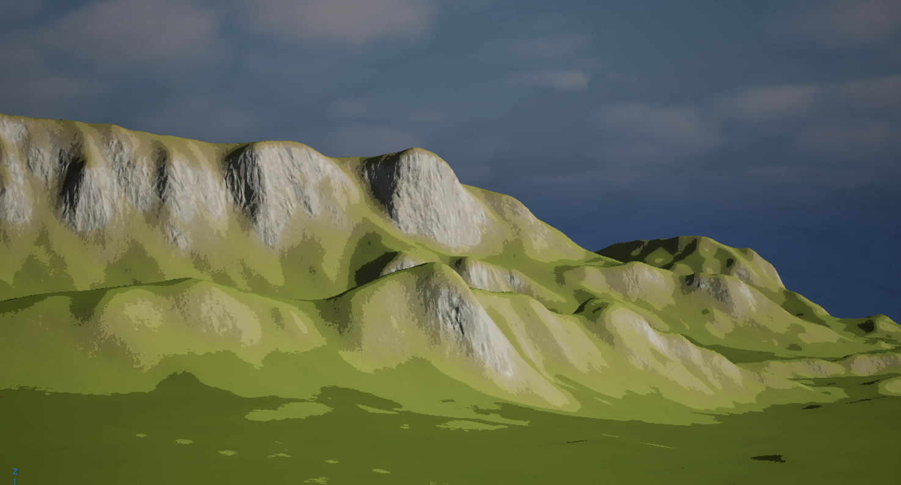
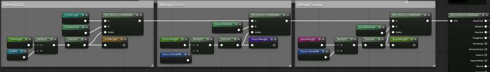
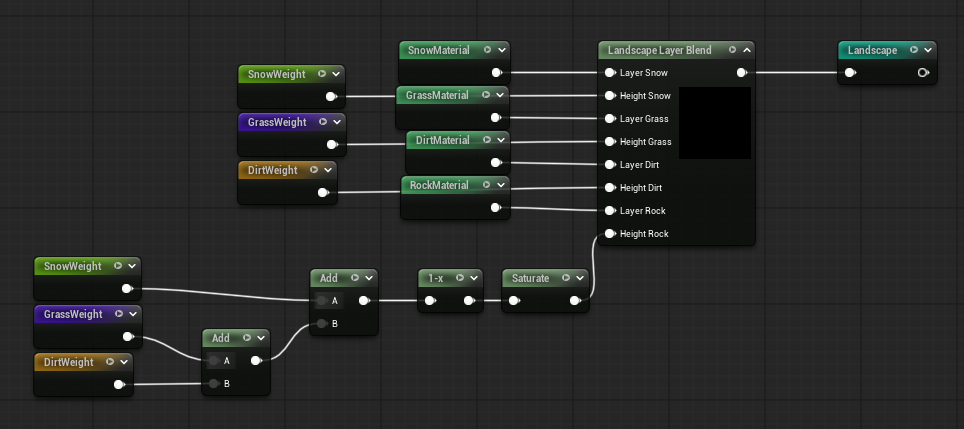
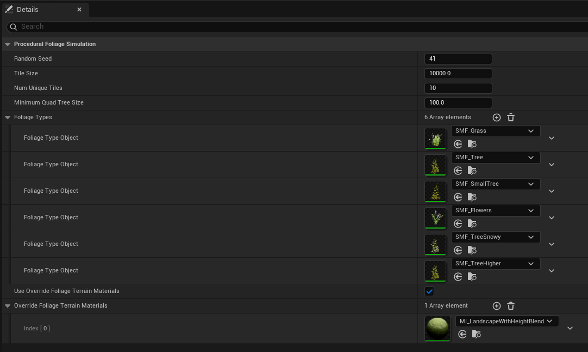

# Auto Landscape Materials - Harry Dillamore

## Height Based

| **Requirement** | **Description / Implementation** | **Evidence** |
| --- | --- | --- |
| **Landscape Material Setup** | I use material functions to set up each part of the material then use the `Landscape Layer Blend` node to combine these textures. This means that the material contains all of the materials and the user is able to paint the landscape once the material is applied. The heightmap input also allows the blending to use the heightmap of each texture in order to make a more convincing transition between materials. |  |
| **Landscape Blending Based on Height** | The material system chooses the appropriate texture by using the `Absolute World Position` Z-axis. The aim is then to create a 0 - 1 value which is used as the alpha input for a `BlendMaterialAttributes` node which `LERPs` between two materials. To create this 0 - 1 value, I use configurable parameters to adjust: the `falloffHeight` which is subtracted from the Z-axis to set the level at which the material is applied, and the `falloffRange` which changes the size of the transition, with a larger number meaning that it blends more gradually over a larger distance in height. An example of how this system works would be if grass is applied with: `falloffHeight` = 25000, `falloffRange` = 2000. Then at a height of 26000 the calculation would be $ {26000-25000 \over 2000} = 0.5 $, meaning that the grass texture would be applied at half strength. To avoid values beyond 0 and 1, a `saturate` node is used to clamp anything outside of this range to either 0 or 1. I created different zones by adjusting the falloff height of the different materials in my landscape material instance. The values I found worked were as seen in the screenshot of my material parameters. I think these values were effective because they used large values for the falloff ranges, meaning that the blending was smooth. I think the look of this could be improved if some noise was introduced into the height blend as it would break up the bands of materials that can be seen when looking at the landscape. |         |

## Slope Based

| **Requirement** | **Description / Implementation** | **Evidence** |
| --- | --- | --- |
| **Slope Calculation** | The landscape material blends textures using the world space slope of the landscape. This is done by taking the `VertexNormal` - which is a normalised Vector3 representing the direction that the vertex is facing in the world - and comparing it with an upwards vector (0, 0, 1) using a `dot Product`. The dot product node returns a value between 1 (if the vectors are the same) and -1 (if the vectors are pointing in opposite directions). This range is then remapped to set the parameter `FalloffPN` as the 0 end of the range, with a flat surface as 1. Meaning that the material will blend from fully visible on a flat surface, to gone at whichever value the user inputs with a smooth transition in between. |   |
| **Layer Blending** | I tried for a long time to get layer blending to work properly, however, I was finding that I could not get the materials layers to apply based on the procedural rules I had written. It should function by having each material filling the landscape, so that which material appears visually is decided by the height values of the layers (the material with the biggest height value would be most visible), which would be generated using the procedural rules. However, I could only get one material to fully cover the landscape at a time, I think means that the height blend was essentially never used because there were no overlapping materials. Instead, I have used a sequence of `blend material attributes` nodes because this allows me to lerp in each material on top of each other, using my slope and height calculations as an alpha. This also allows me to choose which material has proirety based on where they are in the order. I take advantage of this by using the rock as a base over the entire landscape, then blending dirt on top of it, then grass, then snow. |     |
| **Guiding Questions** | Using slope based blending simulates real life landscapes and geology because, for example, you would not see grass growing or snow settling on steep cliff in real life. The `PNFalloff` and `PNContrast` parameters allow the user to adjust the steepness and blending area of the differant materials, meaning that they can observe real life examples of the things similar to the material in use, and aim to match any patterns they see. Complex geometry and overhangs can be handled largly by the procedural system. This is because I have set the rock texture as the base texture, and draw everything else on top of it, for example, grass on flat surfaces below their falloff limit. This means that even if the geometry is overhanging or complex, if it does not meet the requirements for any other material to be painted, it would default to the rock texture. |  |

## Foliage Type Intergration and generation

| **Requirement** | **Description / Implementation** | **Evidence** |
| --- | --- | --- |
| **Foliage Types** | I created 6 differnt foliage types: grass, flowers, dense trees, sparse trees, small trees, and snowy trees. this variety allows me to create differnt areas of foliage cover within the landscape based on what is able to generate in each location |     |
| **Procedual Placement** | Because I was unable to get the landscape layers to work properly, I couldn't use the layer inclusion and exclusion settings for the foliage. If I were to use them they should function by allowing me to specify specific layers and weights of those layers that I want to the foliage to generate. Making it easy to control what the foliage generation is like on each material. Because I was unable to do this, I was able to simulate it in a way by matching the upper and lower limits for height and slope in the foliage settings. This means I am able to create the same outcome as using material layers. In my landscape, I made trees and grass generate at lower heights (the same height as the grass material) and limted growth of all foliage on slopes to 45 degrees and below. I did this because it creates a more realistic looking environment, which follows what you would see in real environments (foliage not growing on rock and slopes). |  |